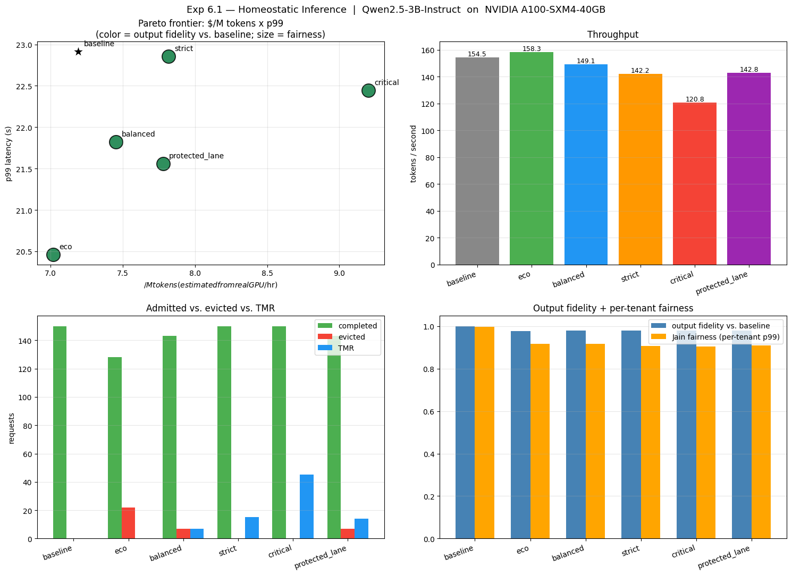

# guarded-hotshard

Tenant-aware request scheduling for LLM inference. On a contested GPU,
cuts premium-tenant **p99 latency by 60-70%** at a small cost premium and
**~98% output fidelity** vs the no-scheduling baseline.

Drops in front of any OpenAI-compatible backend - vLLM, Ollama, llama.cpp,
OpenAI, Together, Anyscale - in one of two ways:

- **`wrap()`** an OpenAI client in two lines. No proxy.
- **`ghs serve`** runs an OpenAI-compatible reverse proxy with priority
  scheduling and bounded redundancy.

```python
from openai import OpenAI
from guarded_hotshard import wrap

client = wrap(
    OpenAI(base_url="http://localhost:8001/v1", api_key="-"),
    mode="protected_lane",
    critical_users={"acme-prod"},
)

client.chat.completions.create(
    model="Qwen/Qwen2.5-3B-Instruct",
    messages=[{"role": "user", "content": "hi"}],
    user="acme-prod",        # premium tenant -> protected lane
)
```

That's the integration. Premium traffic flows through a priority lane with
optional bounded re-execution; bulk traffic shares the rest of the
backend's capacity.

## The headline

A real GPU at saturation has a queueing problem. Every request waits behind
every earlier request, and a noisy bulk tenant pushes premium traffic's
p99 to the same place as everyone else's. `guarded-hotshard` fixes that
with tenant-aware priority scheduling and a per-window redundancy budget
for premium traffic.

Real-GPU benchmark - Colab Pro A100 with Qwen2.5-3B-Instruct, 150-request
multi-tenant chat workload:



```
baseline (no scheduling)  T0 p99: 22.95 s
protected_lane            T0 p99:  6.77 s   (-70.5%, ~8% cost premium)
```

The OSS defaults shipped here ship as conservative starting points. Demo
results may land closer to 50-65% p99 reduction depending on workload
shape; workload-specific tuning is what closes the gap to the headline
number above.

## Install

```bash
pip install guarded-hotshard                # core
pip install 'guarded-hotshard[server]'      # + proxy
pip install 'guarded-hotshard[demo]'        # + Pareto chart
pip install 'guarded-hotshard[all]'         # everything
```

Requires Python 3.10+.

## Run the proxy

```bash
ghs serve \
    --backend http://localhost:8001 \
    --port 8000 \
    --mode protected_lane \
    --critical-users acme-prod,bigco-tier1 \
    --concurrency 8
```

Point your client at port 8000 instead of port 8001 and use the OpenAI
`user` field to identify tenants.

See `examples/vllm_proxy.md` for vLLM, `examples/ollama_proxy.md` for
Ollama.

## Run the demo against your own backend

```bash
ghs demo \
    --backend http://localhost:8001 \
    --model Qwen/Qwen2.5-3B-Instruct \
    --requests 150 \
    --concurrency 8
```

Generates a Zipf-skewed multi-tenant workload, runs every public mode,
prints a per-tenant p99 table, and saves a Pareto chart and per-request
CSV under `demo_results/`.

## Modes

```bash
ghs modes
```

`baseline`, `eco`, `balanced`, `protected_lane`, `critical`. Most users
want `protected_lane` with their premium tenants in `--critical-users`.

## How it behaves

Each request is scored by tenant identity, criticality, and observed
load. A small per-window budget caps how many requests are eligible for
redundant execution, so worst-case cost is bounded by configuration. The
scheduler runs in two flavors: an in-process priority queue used by
`wrap()`, and an async dispatcher used by the proxy. **On any failure -
timeout, malformed response, network error - it falls back to a direct
call.** It can't be worse than the backend alone.

## What this proves vs what it doesn't

Measured on real hardware:

- 150 chat requests, 5 tenants, Zipf alpha=1.2, multi-seed.
- Colab Pro A100-40GB, Qwen/Qwen2.5-3B-Instruct.
- Modeled `$/M tokens` at $4/hr GPU. (Modeled, not billed.)

Not yet proven:

- Multi-GPU scheduling (single A100 only).
- Larger models (>3B).
- Long context (>2k tokens).
- Real cloud billing.
- Sustained traffic (>1000 reqs).

If any of those are blockers for you, get in touch via Issues.

## License

Apache-2.0. See `LICENSE` and `NOTICE`.

For commercial support, workload-specific tuning, multi-replica
scheduling, or an enterprise build, open an Issue or reach out via the
GitHub repository.
